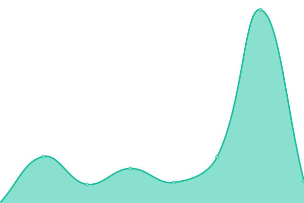
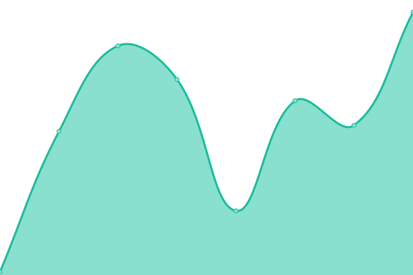
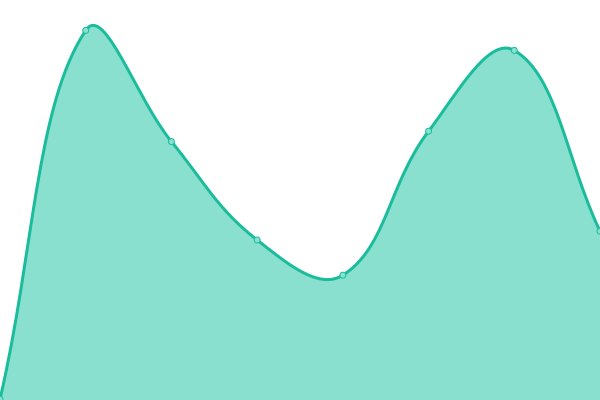
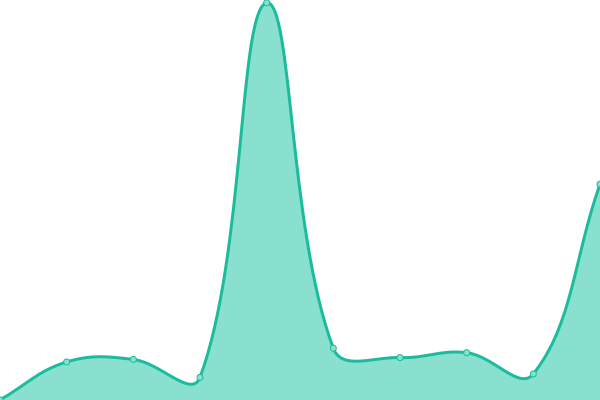

# [📈 Live Status](https://uptime.jonasg.me): <!--live status--> **🟩 All systems operational**

This repository contains the open-source uptime monitor and status page for [JonasGruenwald](jonasg.me), powered by [Upptime](https://github.com/upptime/upptime).

With [Upptime](https://upptime.js.org), you can get your own unlimited and free uptime monitor and status page, powered entirely by a GitHub repository. We use [Issues](https://github.com/JonasGruenwald/uptime-monitor/issues) as incident reports, [Actions](https://github.com/JonasGruenwald/uptime-monitor/actions) as uptime monitors, and [Pages](https://uptime.jonasg.me) for the status page.

<!--start: status pages-->
<!-- This summary is generated by Upptime (https://github.com/upptime/upptime) -->
<!-- Do not edit this manually, your changes will be overwritten -->
<!-- prettier-ignore -->
| URL | Status | History | Response Time | Uptime |
| --- | ------ | ------- | ------------- | ------ |
|  [Gruppo Due Frontend](https://gruppo-due.com/) | 🟩 Up | [gruppo-due-frontend.yml](https://github.com/JonasGruenwald/uptime-monitor/commits/HEAD/history/gruppo-due-frontend.yml) | 

 117ms
     
 | 

<a href="https://uptime.jonasg.me/history/gruppo-due-frontend">100.00%</a>
    

|  [Gruppo Due Backend](https://flouz.mgmt.gruppo-due.com/) | 🟩 Up | [gruppo-due-backend.yml](https://github.com/JonasGruenwald/uptime-monitor/commits/HEAD/history/gruppo-due-backend.yml) | 

 435ms
     
 | 

<a href="https://uptime.jonasg.me/history/gruppo-due-backend">100.00%</a>
    

|  [Gruppo Due Analytics](https://analytics.mgmt.gruppo-due.com/) | 🟩 Up | [gruppo-due-analytics.yml](https://github.com/JonasGruenwald/uptime-monitor/commits/HEAD/history/gruppo-due-analytics.yml) | 

 1020ms
     
 | 

<a href="https://uptime.jonasg.me/history/gruppo-due-analytics">100.00%</a>
    

|  [Personal Site](https://jonasg.me/) | 🟩 Up | [personal-site.yml](https://github.com/JonasGruenwald/uptime-monitor/commits/HEAD/history/personal-site.yml) | 

 286ms
     
 | 

<a href="https://uptime.jonasg.me/history/personal-site">100.00%</a>
    

|  [Kohlswat](https://kohlswat.studio/) | 🟩 Up | [kohlswat.yml](https://github.com/JonasGruenwald/uptime-monitor/commits/HEAD/history/kohlswat.yml) | 

 641ms
     
 | 

<a href="https://uptime.jonasg.me/history/kohlswat">100.00%</a>
    

|  [Distancing Admin](https://admin.distancing.space) | 🟩 Up | [distancing-admin.yml](https://github.com/JonasGruenwald/uptime-monitor/commits/HEAD/history/distancing-admin.yml) | 

 515ms
     
 | 

<a href="https://uptime.jonasg.me/history/distancing-admin">100.00%</a>
    

|  [Fumetto Frontend](https://fumetto.ch/) | 🟩 Up | [fumetto-frontend.yml](https://github.com/JonasGruenwald/uptime-monitor/commits/HEAD/history/fumetto-frontend.yml) | 

 467ms
     
 | 

<a href="https://uptime.jonasg.me/history/fumetto-frontend">100.00%</a>
    

|  [Fumetto Backend](https://admin.fumetto.ch/admin) | 🟩 Up | [fumetto-backend.yml](https://github.com/JonasGruenwald/uptime-monitor/commits/HEAD/history/fumetto-backend.yml) | 

 1049ms
     
 | 

<a href="https://uptime.jonasg.me/history/fumetto-backend">100.00%</a>
    

|  [Posterator Frontend](https://poster.coalandice.org/) | 🟩 Up | [posterator-frontend.yml](https://github.com/JonasGruenwald/uptime-monitor/commits/HEAD/history/posterator-frontend.yml) | 

 120ms
     
 | 

<a href="https://uptime.jonasg.me/history/posterator-frontend">100.00%</a>
    

|  [Posterator Backend](https://poster.coalandice.org/backend/admin) | 🟩 Up | [posterator-backend.yml](https://github.com/JonasGruenwald/uptime-monitor/commits/HEAD/history/posterator-backend.yml) | 

 29ms
     
 | 

<a href="https://uptime.jonasg.me/history/posterator-backend">100.00%</a>
    

|  [76666 World](https://76666.world/) | 🟩 Up | [76666-world.yml](https://github.com/JonasGruenwald/uptime-monitor/commits/HEAD/history/76666-world.yml) | 

 187ms
     
 | 

<a href="https://uptime.jonasg.me/history/76666-world">99.82%</a>
    

|  [V8](http://viktoria8.de/) | 🟩 Up | [v8.yml](https://github.com/JonasGruenwald/uptime-monitor/commits/HEAD/history/v8.yml) | 

 338ms
     
 | 

<a href="https://uptime.jonasg.me/history/v8">100.00%</a>
    

|  [V8 Shop](https://shop.viktoria8.de/) | 🟩 Up | [v8-shop.yml](https://github.com/JonasGruenwald/uptime-monitor/commits/HEAD/history/v8-shop.yml) | 

 392ms
     
 | 

<a href="https://uptime.jonasg.me/history/v8-shop">100.00%</a>
    

<!--end: status pages-->

[**Visit our status website →**](https://uptime.jonasg.me)

## 📄 License

- Powered by: [Upptime](https://github.com/upptime/upptime)
- Code: [MIT](./LICENSE) © [JonasGruenwald](jonasg.me)
- Data in the `./history` directory: [Open Database License](https://opendatacommons.org/licenses/odbl/1-0/)
